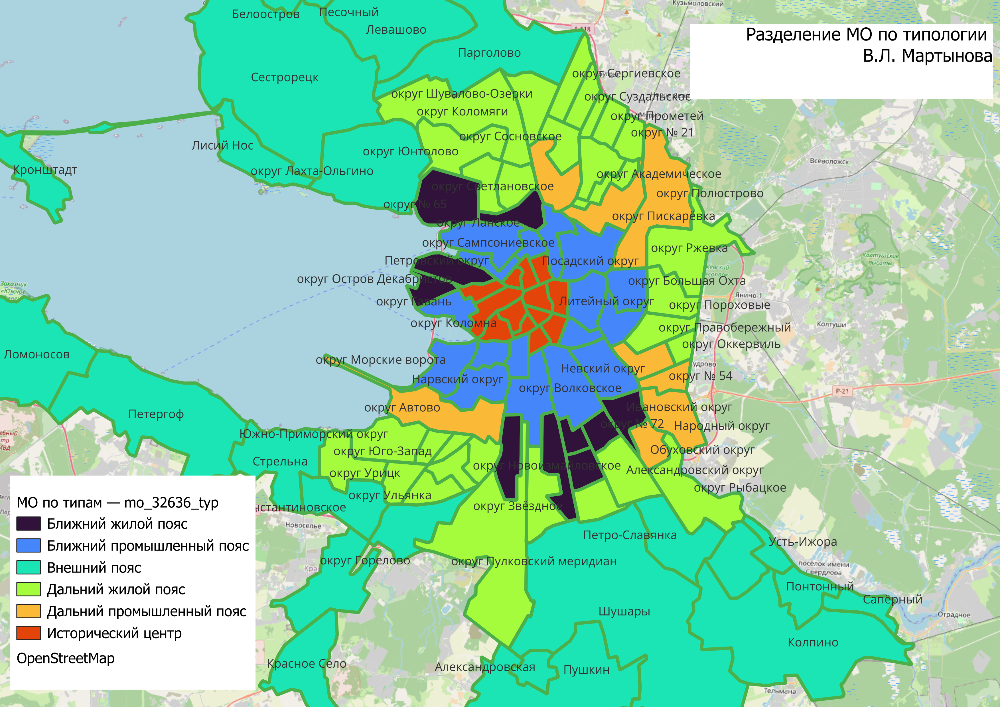
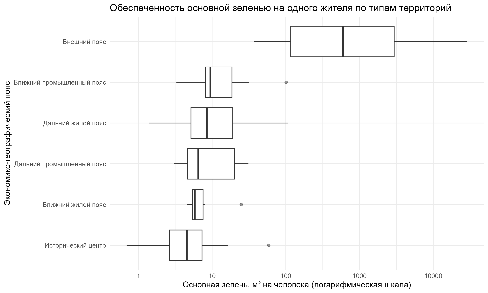
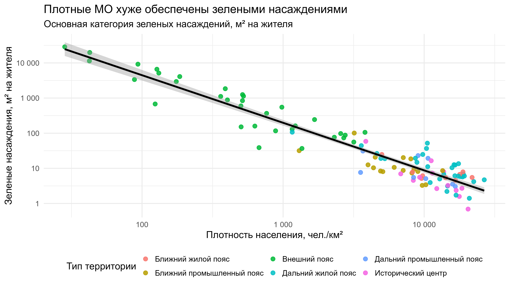
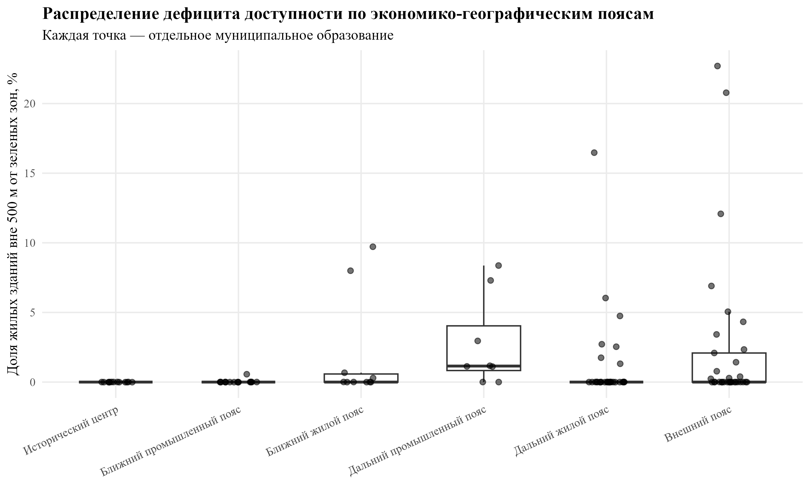

# GIS Analysis of the Distribution of Green Areas in St. Petersburg

Master's thesis project completed at HSE University (Saint Petersburg).

## Project Overview

This study examines environmental inequality in the distribution and accessibility of urban green spaces across municipalities of Saint Petersburg.

The project combines GIS analysis, spatial accessibility assessment, and statistical methods to investigate differences in green-space provision between municipal territories.

## Research Questions

- Do municipalities differ in green-space provision depending on their territorial type?
- Is population density associated with lower green-space availability?
- Does accessibility to green spaces vary across municipalities?
- Are municipalities with a higher share of children characterized by lower accessibility to green spaces?

## Methods

- GIS analysis (QGIS)
- Spatial accessibility analysis
- Buffer analysis (500 m and 1000 m)
- Spearman correlation
- Kruskal–Wallis test
- Descriptive statistics
- R programming

## Municipal Typology



## Distribution of Green Spaces


## Main Findings

- Significant differences in green-space provision were identified across territorial zones.
- Population density is negatively associated with green-space availability.
- Municipalities with a higher share of children tend to have lower accessibility to green spaces.
- Peripheral municipalities generally demonstrate higher levels of green-space provision than central urban territories.

## Resalts 

# H1. Green space provision differs across urban zones



Municipalities located in the outer belt have substantially higher green space provision per capita than municipalities located in the historical center and residential belts.

# H2 Population density is negatively associated with green space provision



Population density demonstrates a strong negative relationship with green space provision per capita.

# H3 Accessibility of green areas varies across urban zones


The largest accessibility deficits are observed in the outer and industrial belts, while municipalities in the historical center generally exhibit full accessibility to green areas within a 500-meter walking distance.

## Repository Structure

```text
Data/
├── raw/
├── processed/

R/
├── 01_exploratory_analysis.R
├── 02_hypothesis_1.R
├── 03_hypothesis_2.R
└── 04_hypothesis_3.R

Outputs/
├── Maps/
├── Figures/
└── Tables/
```

## Software

- QGIS
- R
- OpenStreetMap
- Microsoft Excel

## Author

Yuriy Sidorov

Master's Programme in Sociology

HSE University, Saint Petersburg 2026